# 🎬 Cinema Booking System

**A full-featured movie ticket booking platform with real-time seat selection**

[Features](#-features) • [Tech Stack](#-tech-stack) • [Installation](#-installation) • [Screenshots](#-screenshots)

---

## ✨ Features

### 🎭 For Movie Lovers

| Feature | Description |
|---------|-------------|
| 🎬 **Movie Discovery** | Browse now showing & coming soon movies with rich details |
| 🎟️ **Smart Seat Selection** | Interactive seat map with Standard/VIP pricing |
| 📅 **Date & Time Picker** | Easy showtime selection with cinema filtering |
| 💳 **Secure Checkout** | Multiple payment methods (Card, ABA, Wing, ACLEDA, Cash) |
| 🧾 **Digital Tickets** | QR code tickets for cinema entry |
| 📱 **Responsive Design** | Perfect experience on desktop, tablet & mobile |

### 👑 For Admins

| Feature | Description |
|---------|-------------|
| 📊 **Dashboard** | Overview of system activity |
| 🎬 **Movie Management** | Add/Edit/Delete movies with poster & banner upload |
| 🏢 **Cinema Management** | Manage cinema locations, formats & pricing |
| ⏰ **Showtime Management** | Schedule showtimes with bulk creation |
| 💺 **Hall & Seat Management** | Configure seating layouts and VIP rows |
| 📋 **Booking Management** | View and manage customer bookings |

---

## 🛠️ Tech Stack

### Backend
- Laravel 11.x (RESTful API)
- Laravel Sanctum (Authentication)
- Eloquent ORM
- MySQL Database
- File Storage (Posters/Banners)

### Frontend
- Nuxt 3 (Vue 3)
- Composition API
- Pinia (State Management)
- Tailwind CSS
- Radix Vue UI Components
- Lucide Icons

---

### 📸 Screenshots

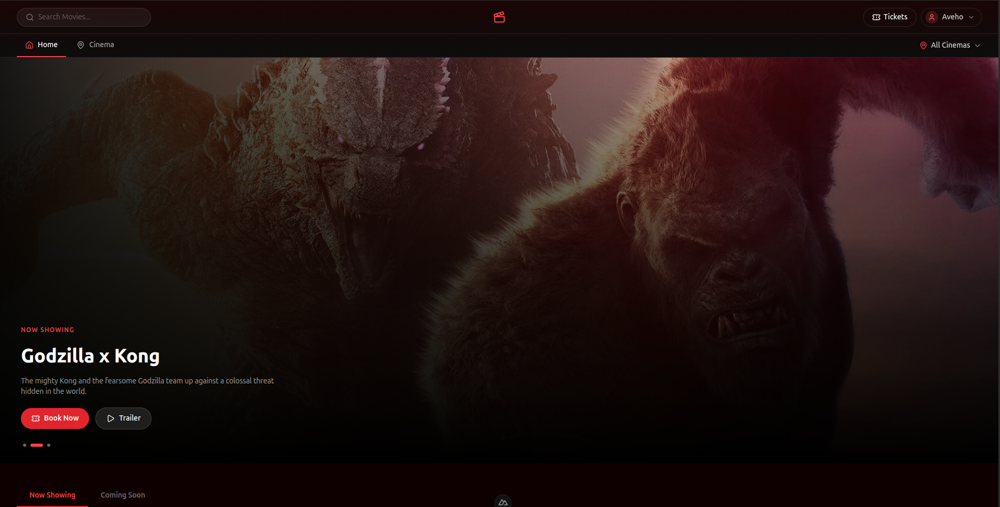
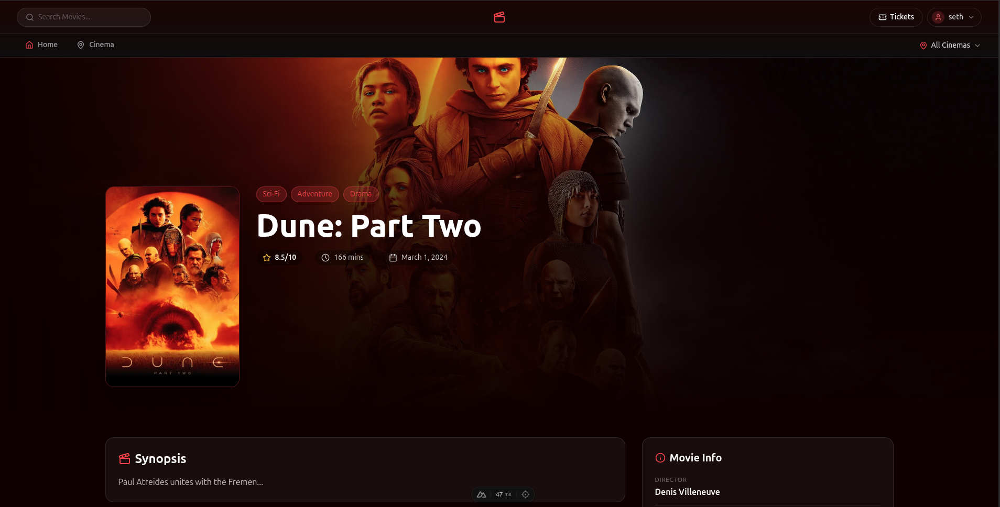

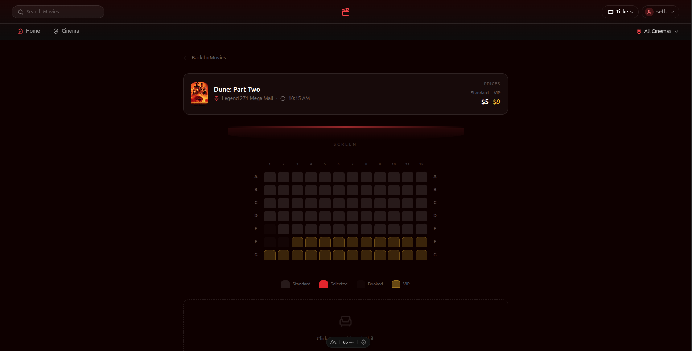
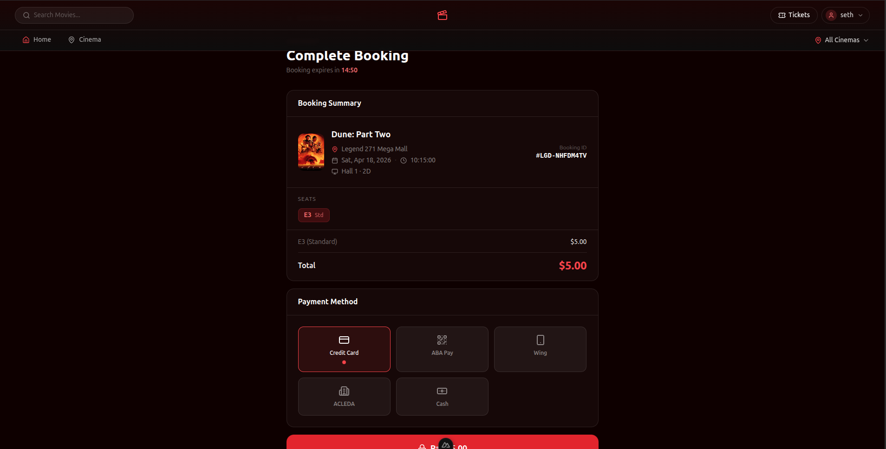
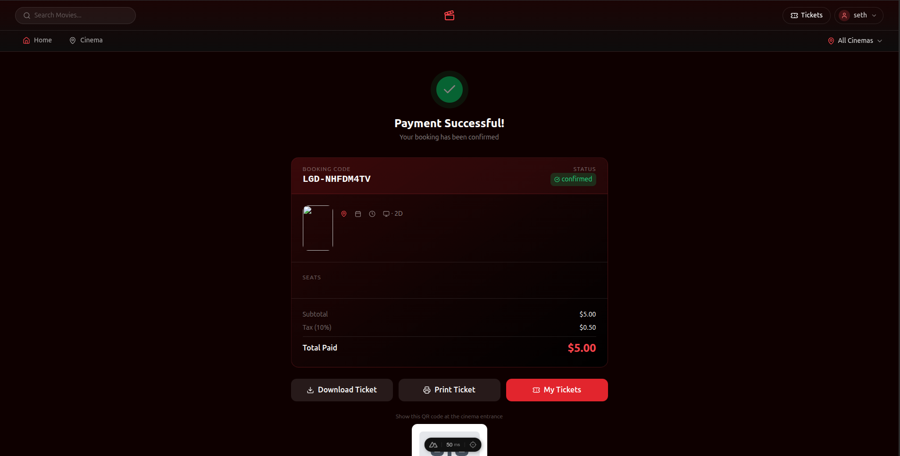
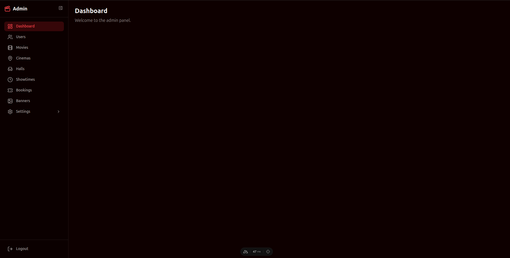
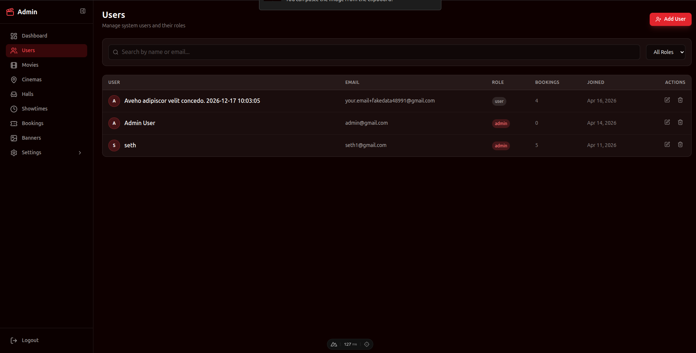

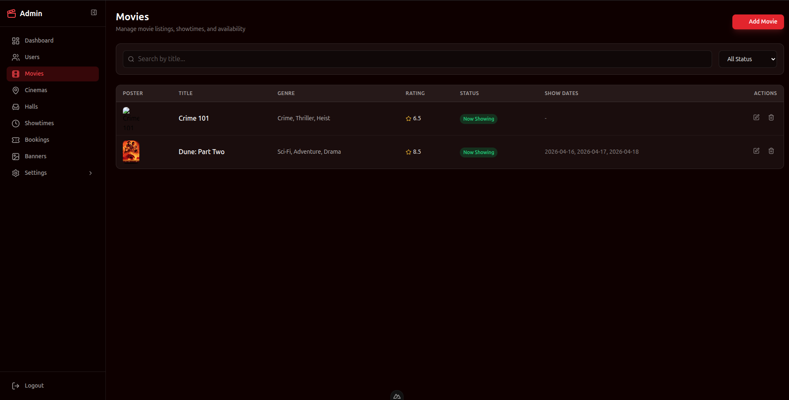
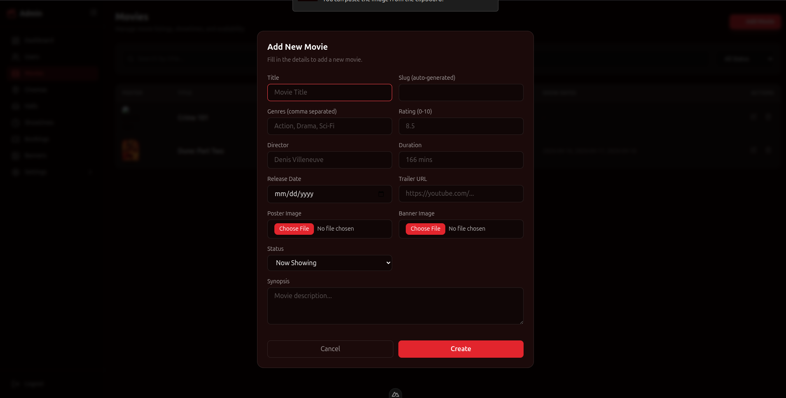
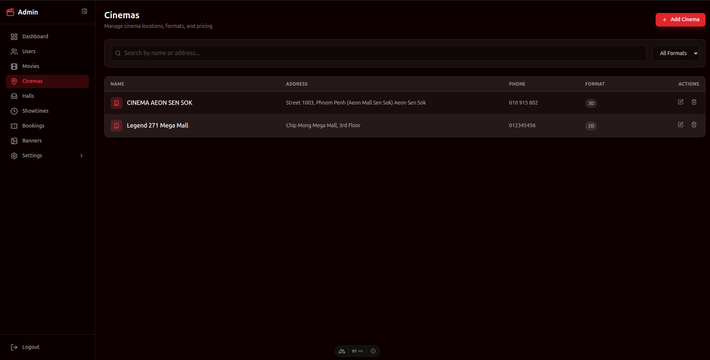
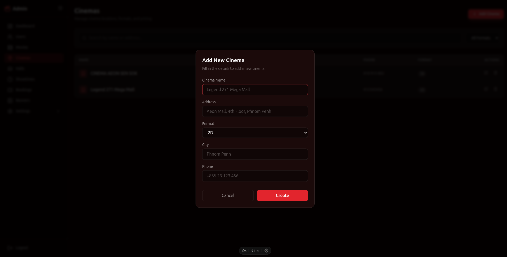
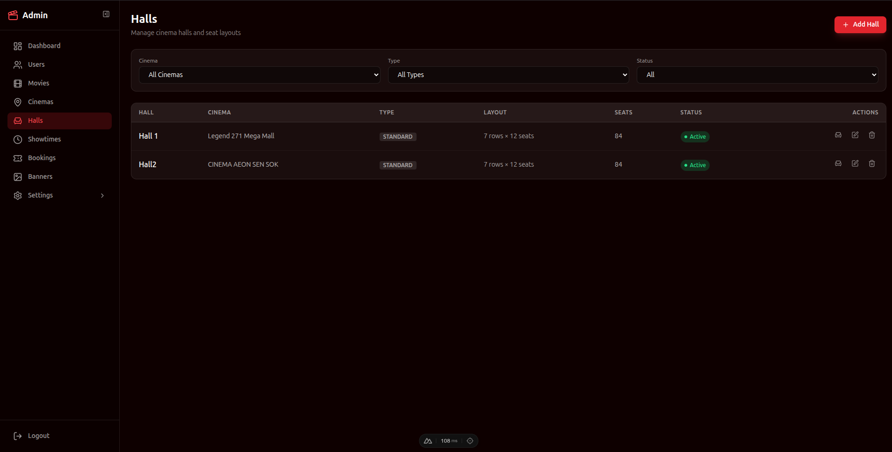
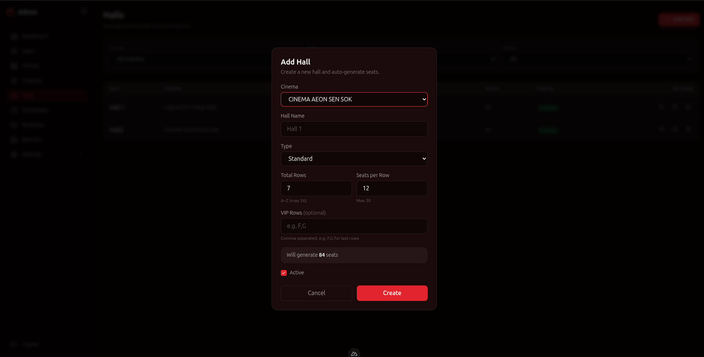
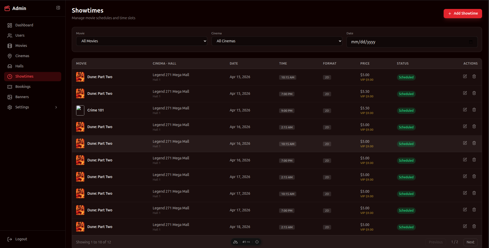

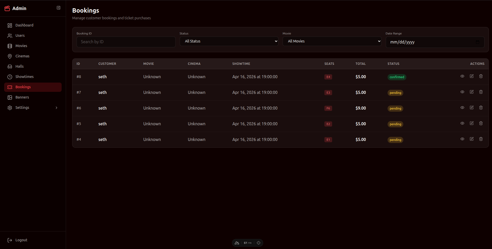
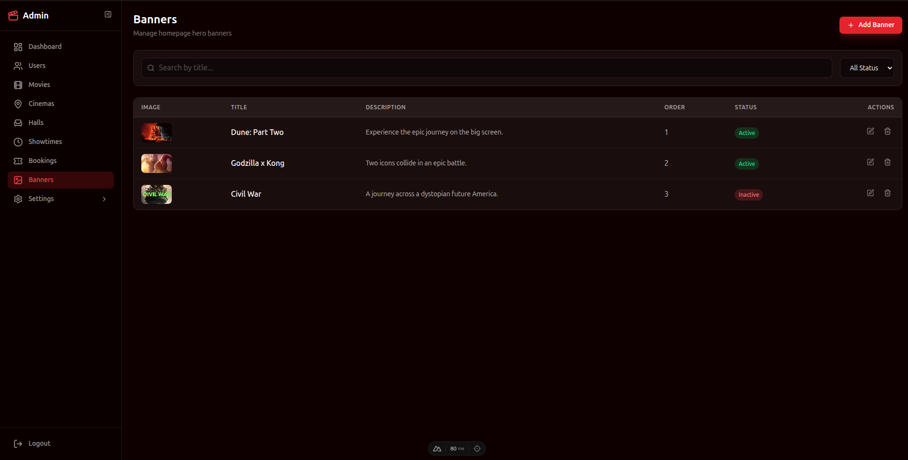
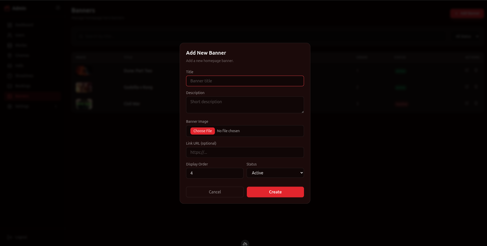
